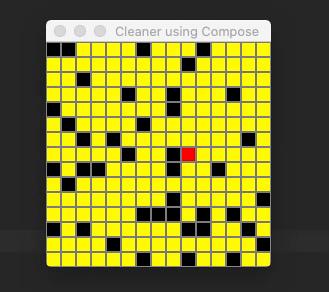

# Cleaner Compose
Cleaner Compose is a visualization of a 2D grid cleaner with the objective to clean the entire room. 
The catch is to avoid the walls and to clean all the possible areas reachable by the starting point of the cleaner.

The algorithm used to traverse the room is Depth-First Search.

## Requirements

- IntelliJ IDEA 2021 1.3 (or later)

## Technologies

- [Kotlin 1.5.10](https://kotlinlang.org/)
- [Compose for Desktop UI](https://www.jetbrains.com/lp/compose/)
- [Kotlin Coroutines](https://developer.android.com/kotlin/coroutines)
